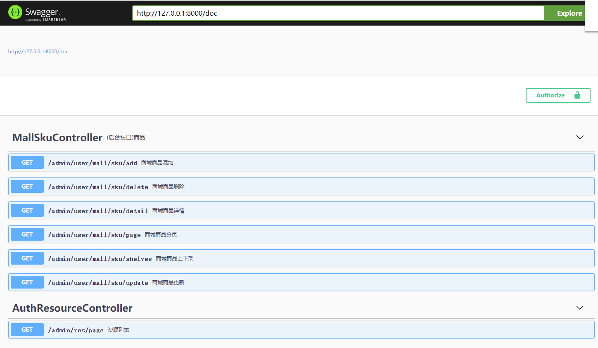
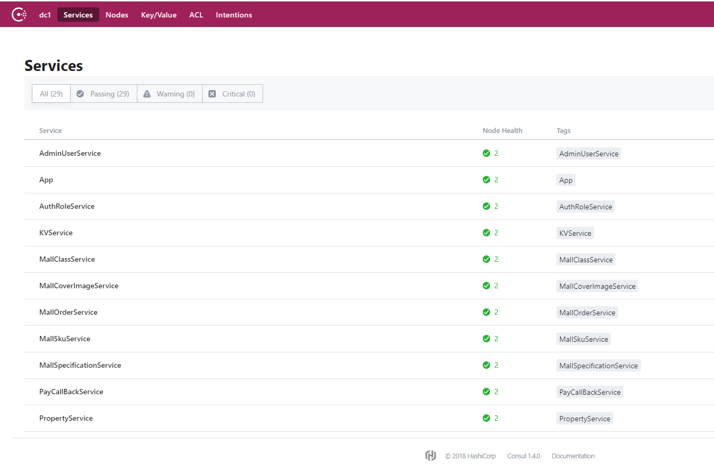

# GoMybatisMall
GoMybatis based  mall project

基于 [GoMybatis](https://github.com/zhuxiujia/GoMybatis) 的 微服务商城，国内唯一一款满足使用spring一般企业开发规范，满足高并发，微服务项目

注意：本项目架构拷贝自生产环境源码的改版，经过生产环境检验！

* 适用于给 初学GoMybatis开发者作为 示例或参考用或者快速开发一个GoMybatis项目.
* 适用于Java服务端开发者学习适用go项目（jvm开发者一般都是公司性质，注重扩展性和简单化，适用于习惯SSM组合的开发者，即SpringBoot,SpringMVC,Mybatis）
* 非常适合需要快速敏捷业务开发的(哪怕是需求变化快速的外包后台项目，基于它 改起来 也是游刃有余)，执行异常快速，适合低功耗电脑（例如笔记本），go本身写test和benchamrk简单，利于测试，压测
* 如果您是netflix spring cloud使用者，那么在（架构上）会非常熟悉此项目。 始于Spring ， 敏捷开发之时，大道至简

### 谈特性（足以应付大部分互联网服务端应用）
+ 秒启动（完成项目扫描,bean注入，总耗时小于1秒内）内存占用低于20MB
+ 集成 Swagger UI（go语言中唯一使用接口注解）和移动端前端沟通更便利~
+ 集成Excel报表导出（详见UserController.go）
+ 集成cron表达式，支持定时任务（详见OrderNotifyZfbSchedule.go）
+ 集成redis,RedisTemplete (详见StoreServiceImpl.go 中的使用)
+ 集成GoMybatis,(详见 core/com/example/dao/包中的使用)
+ 集成基本的商城业务，用户注册，后台用户，权限表，图形验证码
+ 集成基于statik静态文件打包
+ 集成gofastdfs分布式静态文件存储
+ 集成Docker容器化部署脚本，和执行脚本

### 谈设计
+ 本项目使用基本的微服务设计（Controller-Service Discovery-Rpc LB-Service）拆分粒度为最大化（仅包含 一个网关和一个微服务，实际项目需要根据业务自己评估拆分，自定义自己的负载均衡LB策略）
+ 关于网关（自行设计controller 作为网关做鉴权，注意本项目作为案例未加入，但是可以把controller层视为网关）
+ 关于链路追踪（需要自行封装链路追踪，本项目基于rpc ，使用方式上没差别。注意本项目未加入）
+ 关于熔断（需要自行封装熔断，本项目基于rpc ，使用方式上没差别。注意本项目未加入）
+ 关于分布式唯一id（推荐使用其他的算法例如 雪花snowflake，本项目为了简单 默认使用uuid生成）
+ 关于服务发现（本项目使用consul，也意味着支持spring cloud 调用基于本项目的集群）
+ 关于sql不推荐或极少使用join语句,外键，触发器，存储过程（一般不超过3条，且join的应该是同业务的表，禁止跨服务join），而是使用 查询后组合的方法（因为go查询并发执行，为分库分表做万全准备）
+ gomybatis的xml里不出现任何的包名（得益于 设计之初 遵循单一职责原则和序列化方法定义在xml中和结构体tag中）似乎有点洁癖+强迫症，哈哈
+ 关于事务，已处理好core服务中嵌套事务传播行为

### 谈架构:
* 必须的库
+ log（日志推荐使用golang官方（官方最稳定，其他库太重，本项目不赞成引入），仅写入到静态文件）
+ consul(服务发现，consul是支持spring cloud的go语言分布式服务发现) 
+ [easy_mvc](https://github.com/zhuxiujia/easy_mvc) （拟mvc设计）
+ [easyrpc](https://github.com/zhuxiujia/easyrpc) （封装定义,支持事务传播，基于go官方rpc库封装，兼容性也好）
+ [easyrpc_discovery](https://github.com/zhuxiujia/easyrpc_discovery) （微服务发现）
+ GoMybatis 
+ Mysql5.7
+ redis

* 可选的库
+ GoFastdfs(开源分布式文件存储,你也可以选择其他的例如 阿里云oss) 
+ statikFs(开源静态文件编译，用于打包外部配置文件，mapper xml文件 进程序（打包的本质是生成string全局变量模拟已打包的文件，如不适用，需要自行打包配置文件上传目录) 

## 谈编译打包
+ DockerFile镜像打包(详情请查看 build_app.sh build_core.sh build_discover.sh)
+ jenkins打包（仅提供步骤脚本）

### 谈目录结构 DDD（领域驱动设计）分层 介绍:
+ app/admin接口层,位于app/com/controller/目录下，也可以看做网关鉴权层（基于JWT token（使用BCryptPasswordEncoder同时兼容java和go）配合easy_mvc过滤器）
+ core/服务层,也是核心业务层
+ common 公共库（Domain model,Rpc model,DTO model,VO model）
+ consul/存放下载好的consul可执行文件
+ controller/网关层
+ database/dao数据库层
+ db/ 存放mysql表结构

### 谈项目接口分层
+ app(提供app接口)
+ admin(后台接口)

### 谈包管理
+ mod (golang官方推荐)
### 安装依赖，win/mac os 命令行执行(前提，需要安装go环境，并且建议打开go mod 选项为auto，自行百度教程~)
```
go mod download
```
### 谈运行和debug（当然是每次都小于1秒内启动完毕，反观spring cloud那缓慢的启动时间.....）
+  下载并且安装[GoLand](https://www.jetbrains.com/go/)   IDE自行激活(建议使用GoLand，如果你对VSCode非常熟悉也行)
+  阅读readme.md文件
+  1打开discovery目录，选择你的系统 解压对应的 consul 可执行文件(PS consul其实也是开源go程序，这里是下载编译好的)，然后 使用右键执行脚本run_linux.sh 或者 windows.bat (goland 需要安装插件)
+  2打开app/main/App.go 找到main方法 点击绿色按钮执行(即可看到接口以及swagger完美启动)，或者 go run App.go
```go
2020/04/06 02:32:34 [easy_mvc] swagger ui yaml config on :http://127.0.0.1:8000/doc
2020/04/06 02:32:34 [easy_mvc] swagger ui web start on :http://127.0.0.1:8000/swagger
```

+  3打开core/main/CoreService.go 找到main方法 点击绿色按钮执行，或者 go run CoreService.go 
+  在这之后，可以在consul后台查看到启动的微服务 (http://127.0.0.1:8500/)

+  现在也可以访问接口地址  http://127.0.0.1:8000/
+  例如访问验证码接口 http://127.0.0.1:8000/api/captcha  即可返回
```json
{"code":-1,"msg":"手机号不能空！","data":null}
```


### 最后
* 告别java的编译慢，告别过早优化万恶之源
* 快速结束开发，而且还保障高性能，保护渐渐消失的头发...
* 不失原有java服务端的简洁性，同时享受golang的异步超高并发，超快编译速度，像python一样简单的特性吧...   别忘记喜欢的话 右上角点个赞


### 如果需技术支持，欢迎联系(付费)

